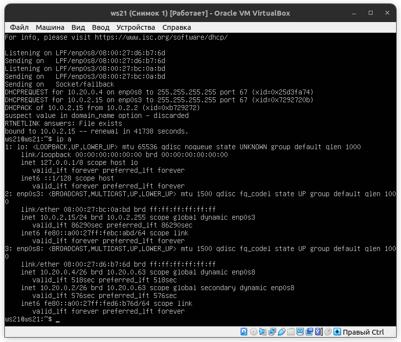

# DO2_LinuxNetwork-1  

## Part 1. Инструмент ipcalc
### 1.1. Сети и маски
Определить и записать в отчёт:  
#### 1) адрес сети 192.167.38.54/13
  
адрес сети 192.160.0.0/13  
#### 2) перевод маски 255.255.255.0 в префиксную и двоичную запись, /15 в обычную и двоичную, 11111111.11111111.11111111.11110000 в обычную и префиксную
255.255.255.0  
  

/15  
  

11111111.11111111.11111111.11110000  

#### 3) минимальный и максимальный хост в сети 12.167.38.4 при масках: /8, 11111111.11111111.00000000.00000000, 255.255.254.0 и /4
/8  

  
11111111.11111111.00000000.00000000  
 

255.255.254.0  

/4  

### 1.2. localhost
Определить и записать в отчёт, можно ли обратиться к приложению, работающему на localhost, со следующими IP: 194.34.23.100, 127.0.0.2, 127.1.0.1, 128.0.0.1  

Для ip 194.34.23.100 обратиться к приложению работающему на localhost не возможно.  
Для адресов 127.0.0.2, 127.1.0.1 и 128.0.0.1 это сделать возможно:  

### 1.3. Диапазоны и сегменты сетей
Определить и записать в отчёт:  
#### 1) какие из перечисленных IP можно использовать в качестве публичного, а какие только в качестве частных: 10.0.0.45, 134.43.0.2, 192.168.4.2, 172.20.250.4, 172.0.2.1, 192.172.0.1, 172.68.0.2, 172.16.255.255, 10.10.10.10, 192.169.168.1
Адреса 10.0.0.45, 192.168.4.2, 172.20.250.4, 172.16.255.255, 10.10.10.10 доступны только в качестве частных.  
  
  

Адреса 134.43.0.2, 172.0.2.1, 192.172.0.1, 172.68.0.2, 192.169.168.1 доступны в качестве публичных.  
  
  

#### 2) какие из перечисленных IP адресов шлюза возможны у сети 10.10.0.0/18: 10.0.0.1, 10.10.0.2, 10.10.10.10, 10.10.100.1, 10.10.1.255
Для ip 10.10.0.0/18 возможны шлюзы в диапазоне 10.10.0.1 - 10.10.63.254, соответственно ip 10.10.100.1 не может быть шлюзом  

## Part 2. Статическая маршрутизация между двумя машинами
#### С помощью команды ip a посмотреть существующие сетевые интерфейсы
ws1  
  

ws2  
  

#### Описать сетевой интерфейс, соответствующий внутренней сети, на обеих машинах и задать следующие адреса и маски: ws1 - 192.168.100.10, маска /16, ws2 - 172.24.116.8, маска /12
ws1:  

ws2:  

#### Выполнить команду netplan apply для перезапуска сервиса сети
ws 1:  

ws 2:  

### 2.1. Добавление статического маршрута вручную
#### Добавить статический маршрут от одной машины до другой и обратно при помощи команды вида ip r add
ws1:  
  

ws2:  

#### Пропинговать соединение между машинами
ws1:  
  

ws2:  

### 2.2. Добавление статического маршрута с сохранением

#### Добавить статический маршрут от одной машины до другой с помощью файла etc/netplan/00-installer-config.yaml
ws1:  

ws2:  

#### Пропинговать соединение между машинами
ws1:  

ws2:  

## Part 3. Утилита iperf3
### 3.1. Скорость соединения
Базовой единицей скорости передачи информации является бит в секунду (бит/с). Разница между байтами в секунду (Б/с) и битами в секунду (бит/c) такая же, как разница между байтами (Б) и битами (бит): 1 Б/с = 8 бит/с. Точно так же разница между килобайтами в секунду (КБ/с) и Б/с такая же, как разница между килобайтами и байтами: 1 КБ/с = 1024 Б/с. И так далее.

Перевести и записать в отчёт:

8 Mbps (мегабит в секуду) = 1 MB/s (мегабайт в секунду)

100 MB/s (мегабайт в секунду) = 800 000 Kbps (килобит в секунду)

1 Gbps (гигабит в секунду) = 1 000 Mbps (мегабит в секунду)

### 3.2. Утилита iperf3
Измерить скорость соединения между ws1 и ws2:  

## Part 4. Сетевой экран
### Создать файл /etc/firewall.sh, имитирующий фаерволл, на ws1 и ws2:  
Нужно добавить в файл подряд следующие правила:

1) на ws1 применить стратегию когда в начале пишется запрещающее правило, а в конце пишется разрешающее правило (это касается пунктов 4 и 5)

2) на ws2 применить стратегию когда в начале пишется разрешающее правило, а в конце пишется запрещающее правило (это касается пунктов 4 и 5)

3) открыть на машинах доступ для порта 22 (ssh) и порта 80 (http)

4) запретить echo reply (машина не должна "пинговаться”, т.е. должна быть блокировка на OUTPUT)

5) разрешить echo reply (машина должна "пинговаться")
  

Запустить файлы на обеих машинах командами chmod +x /etc/firewall.sh и /etc/firewall.sh  
  

Разница между стратегиями, применёнными в первом и втором файлах, заключается в следующем: в утилите iptables правила выполняются сверху вниз. На первой машине первым указано запрещающее правило на выход, поэтому она не сможет пропинговать другую машину. У второй машины, наоборот - первым указано разрешающее правило, значит она сможет пропинговать другую машину.

### 4.2. Утилита nmap
nmap - это очень популярный сканер сети, для исследования сети и аудита безопасности. Он имеет открытый исходный код, который может использоваться как в Windows, так и в Linux.

Эта программа помогает системным администраторам очень быстро понять какие компьютеры подключены к сети, узнать их имена, а также посмотреть какое программное обеспечение на них установлено, какая операционная система и какие типы фильтров применяются.

Этот инструмент обычно используется хакерами и энтузиастами кибербезопасности, а также сетевыми и системными администраторами. Он используется для следующих целей:  
    информация о сети в режиме реального времени;  
    подробная информация обо всех IP-адресах, активированных в вашей сети;  
    количество открытых портов в сети;  
    предоставить список живых хостов;  
    сканирование портов, ОС и хостов;  
    посмотреть типы применямых фильтров. Например, с помощью скриптов можно автоматически обнаруживать новые уязвимости безопасности в сети. Чаще всего nmap используется для сканирования системы по имени хоста или IP-адресу. Одной из особенностей nmap является то, что эта утилита может определить, включен ли хост, даже если его нельзя пропинговать.  .

### 4.2.1 Поиск машины, которая не "пингуется"

  
В файле firewall.sh для первой машины первым было указано запрещающее правило, поэтому она не пингуется. Для проверки того чтобы показать, что хост машины запущен воспользуемся утилитой nmap. Установим утилиту nmap с помощью следующей команды. Во время установки появится запрос, нужно будет согласиться.

Запускаем утилиту nmap (для проверки ищем в выводе nmap наличие строки Host is up)  

### 4.2.2 Сохраняем дампы образов виртуальных машин.
Для сохранения образов машины в настройках машины выбираем Опции - Снимки.  
  
Выбираем Сделать и добавляем снимки.  
  
Задаём снимку имя и описываем его.  
  

## Part 5. Статическая маршрутизация сети
### 5.1. Настройка адресов машин
### 5.1.1 Настроить конфигурации машин в etc/netplan/00-installer-config.yaml согласно сети на рисунке.

### 5.1.2 Перезапустить сервис сети и проверить адрес машины

Пропингуем ws22 с ws21  

Пропингуем r1 с ws11  

### 5.2. Включение переадресации IP-адресов.
#### Для включения переадресации IP, выполните команду на роутерах:
sysctl -w net.ipv4.ip_forward=1  
При таком подходе переадресация не будет работать после перезагрузки системы.

#### Откройте файл /etc/sysctl.conf и добавьте в него следующую строку:
net.ipv4.ip_forward = 1  
При использовании этого подхода, IP-переадресация включена на постоянной основе.

### 5.3. Установка маршрута по-умолчанию
#### Настроить маршрут по-умолчанию (шлюз) для рабочих станций. Для этого добавить default перед IP роутера в файле конфигураций

#### Вызвать ip r и показать, что добавился маршрут в таблицу маршрутизации

#### Пропинговать с ws11 роутер r2 и показать на r2, что пинг доходит. Для этого использовать команду: tcpdump -tn -i eth1

### 5.4. Добавление статических маршрутов
#### Добавить в роутеры r1 и r2 статические маршруты в файле конфигураций.

#### Вызвать ip r и показать таблицы с маршрутами на обоих роутерах. Пример таблицы на r1:

#### Запустить команды на ws11:
  
Для адреса 10.10.0.0/18 был выбран маршрут, отличный от 0.0.0.0/0 (он попадает под маршрут по-умолчанию), т.к. машина ws11 соединена с сетью 10.10.0.0/18 по своему IP-адресу 10.10.0.2, для других адресов используется маршрут по умолчанию, который указан в файле 10.10.0.1.

#### 5.5. Построение списка маршрутизаторов
Запускаем на r1 команду дампа  tcpdump -tnv -i enp0s8

    -n - не конвертировать адреса в имена;
    -t - не выводить время при выводе каждой строкчи дампа;
    -v - выводить более подробную информацию. Например, печатаются время создания, общая длина и параметры IP-пакета. Также включает дополнительные проверки целостности пакетов, такие как проверка контрольной суммы заголовка IP и ICMP.  

  
При помощи утилиты traceroute построим список маршрутизаторов на пути от ws11 до ws21.  

    Каждый пакет проходит на своем пути определенное количество узлов, пока достигнет своей цели.
    Причем, каждый пакет имеет свое время жизни. Это количество узлов, которые может пройти пакет перед тем, как он будет уничтожен.
    Этот параметр записывается в заголовке TTL, каждый маршрутизатор, через который будет проходить пакет уменьшает его на единицу. 
    При TTL=0 пакет уничтожается, а отправителю отсылается сообщение Time Exceeded.

    Команда traceroute linux использует UDP пакеты. 
    Она отправляет пакет с TTL=1 и смотрит адрес ответившего узла, дальше TTL=2, TTL=3 и так пока не достигнет цели. 
    Каждый раз отправляется по три пакета и для каждого из них измеряется время прохождения. 
    Пакет отправляется на случайный порт, который, скорее всего, не занят. 
    Когда утилита traceroute получает сообщение от целевого узла о том, что порт недоступен трассировка считается завершенной.

#### 5.6. Использование протокола ICMP при маршрутизации
Запустим на r1 перехват сетевого трафика, проходящего через enp0s8 с помощью команды  

    sudo tcpdump -n -i enp0s8 icmp

Пропингуем с ws11 несуществующий IP с помощью команды  
    
    ping -c 1 10.30.0.111

## Part 6. Динамическая настройка IP с помощью DHCP
### 6.1 Настройка службы DHCP на r2
Если утилита isc-dhcp-server ещё не установлена, то файла /etc/dhcp/dhcpd.conf ещё не существует в нужном виде. Соответственно для работы с протоколом DHCP сначала надо установить эту утилиту  

Теперь для r2 можем настроить в файле /etc/dhcp/dhcpd.conf конфигурацию службы DHCP

    указываем адрес маршрутизатора по-умолчанию, DNS-сервер и адрес внутренней сети.

Открываем файл /etc/dhcp/dhcpd.conf для редактирования  
1) Вносим изменения  

2) в файле /etc/resolv.conf(содержит адреса серверов имен, к которым имеет доступ данная система) прописываем nameserver 8.8.8.8  

Перезагрузим службу DHCP

    systemctl restart isc-dhcp-server

Можно проверить статус службы

    sudo systemctl status isc-dhcp-server
  
Изменим настройки машин ws21 и ws22 в файле конфигурации, чтобы сделать протокол DHCP активным. На каждой машине введём  

    sudo vim /etc/netplan/00-installer-config.yaml
    sudo netplan apply
  
  
Перезагружаем виртуальную машину ws21  

    sudo systemctl reboot

Проверяем присвоенный устройствам адрес:  

  
Проверяем соединение машины ws22 с ws21:  

### 6.2 Указать MAC-адреса

Чтобы указать MAC-адрес у ws11, в файл etc/netplan/00-installer-config.yaml надо добавить строки: macaddress: 10:10:10:10:10:BA, dhcp4: true  

    sudo vim /etc/netplan/00-installer-config.yaml
    sudo netplan apply

  
Выключаем машину ws11. Заходим в менеджер виртуальных машин VirtualBox и там настраиваем ws11 MAC-адреc:  
  
Для r1 настроим аналогично r2, но выдачу адресов сделаем с жесткой привязкой к MAC-адресу (ws11):

    sudo apt install isc-dhcp-server

    sudo vim /etc/dhcp/dhcpd.conf

    sudo vim /etc/resolv.conf

    systemctl restart isc-dhcp-server

    sudo systemctl status isc-dhcp-server

Проводим аналогичные тесты - смотрим какой адрес назначен машине ws11:

    ip a
  
Пропингуем соединение с ws22 до ws11:

    ping -c 5 10.10.0.4

### 6.3 Обновление ip адреса с помощью команды sudo dhclient.
Запросим с ws21 обновление ip адреса с помощью команды

    sudo dhclient -v

-v - будет выведена дополнительная информация.  
  
Выполним команду для удаления старого IP адреса

    sudo dhclient -r
-r - явно освобождает текущую аренду ip адреса.  
  
Чтобы обновить или освободить IP-адрес для конкретного интерфейса, например, eth0, необходимо ввести:

    sudo dhclient -r eth0

    sudo dhclient eth0

Проверим IP адреса

    ip a

    В части 6 были использованы следующие опции DHCP протокола:

        option routers ip-address [, ip-address...]; - адреса шлюзов для клиентской сети. Маршрутизаторы должны быть перечислены в порядке предпочтительности.
        option domain-name-servers ip-address [, ip-address...]; - Список DNS серверов доступных клиенту. Сервера должны быть перечислены в порядке предпочтительности.

Сохранить дампы образов виртуальных машин

## Part 7. NAT
Для работы с сервером apache2, установим его на машины r1, r2 и ws22. Возможно apache2 не будет устанавливаться, тогда возможно поможет обновление системы (см. ниже).

    sudo apt install apache2
Обновление системы

    sudo apt update

    sudo apt upgrade -y

-y - при запросе сразу согласиться с установкой.

### 7.1 Делаем сервер Apache2 общедоступным. 
В файле /etc/apache2/ports.conf на ws22 и r2 меняем строку Listen 80 на Listen 0.0.0.0:80.
  
  
Запустить веб-сервер Apache командой на ws22 и r1  

    service apache2 start

### 7.2 Создаем фаервол на r2. Следующие правила:
1) Удаление правил в таблице filter - iptables -F
2) Удаление правил в таблице "NAT" - iptables -F -t nat
3) Отбрасывать все маршрутизируемые пакеты - iptables --policy FORWARD DROP

Запускаем файл

    sudo chmod +x /etc/firewall.sh

    sudo bash /etc/firewall.sh
  

При запуске файла firewall.sh с этими правилами, ws22 не должна "пинговаться" с r1.  
Проверяем соединение между r1 и ws22

    ping -c 5 10.20.0.3

Проверяем соединение между ws22 и r1

    ping -c 5 10.100.0.11

4) Разрешить маршрутизацию всех пакетов протокола ICMP, для этого прописываем правило для протокола icmp и цепочки FORWARD

  
   Проверяем соединение между ws22 и r1  
  
Добавляем в файл ещё два правила:

    Включаем SNAT, а именно маскирование всех локальных ip из локальной сети, находящейся за r2 (по обозначениям из Части 5 - сеть 10.20.0.0)

    Включаем DNAT на 8080 порт машины r2 и добавим к веб-серверу Apache, запущенному на ws22, доступ извне сети

    Значения использованных опций:

        t - указывает на используемую таблицу;
        p - указывает протокол, такие как tcp, udp, udplite и другие, поддерживаемые системой, ознакомиться со списком можно в файле /etc/protocols;
        m - подключает указанный модуль;
        s - указывает адрес источника пакета, в качестве значения можно указать как один IP-адрес, так и диапазон;
        i - задает входящий сетевой интерфейс;
        o - указывает исходящий сетевой интерфейс;
        --dport - порт получателя пакета;
        DNAT — подменяет адрес получателя в заголовке IP-пакета, основное применение — предоставление доступа к сервисам снаружи, находящимся внутри сети;
        SNAT — служит для преобразования сетевых адресов, применимо, когда за сервером находятся машины, которым необходимо предоставить доступ в Интернет, при этом от провайдера имеется статический IP-адрес.

### SNAT и DNAT
NAT — это аббревиатура для преобразования сетевых адресов. NAT возникает при изменении одного из IP-адресов в заголовке IP-пакета, т. е. IP-адреса источника (source-addr) или IP-адреса назначения (dest-addr).  

|   ПАРАМЕТР    |     SNАТ     |                                                                                                                                      DNAT                                                          |
|:-------------:|:------------:|:--------------------------------------------------------------------------------------------------------------------------------------------------------------------------------------------------:|
| Аббревиатура  | источник NAT |                                                                                                                                 назначение NAT                                                     |
| Терминология  |SNAT изменяет частный IP-адрес исходного хоста на общедоступный IP-адрес. Он также может изменить исходный порт в заголовках TCP/UDP. SNAT обычно используется внутренними пользователями для доступа в Интернет.| Назначение DNAT изменяет адрес назначения в IP-заголовке пакета. Он также может изменить порт назначения в заголовках TCP/UDP. DNAT используется, когда нам нужно перенаправить входящие пакеты с общедоступным адресом/портом на частный IP-адрес/порт внутри внутренней сети. |
|Пример использования|Клиент внутри локальной сети и за брандмауэром хотел просматривать Интернет|Веб-сайт, размещенный в центре обработки данных за брандмауэром, и должен быть доступен для пользователей через Интернет|
|Изменение адреса|SNAT изменяет адрес источника пакетов, проходящих через устройство NAT|DNAT изменяет адрес назначения пакетов, проходящих через маршрутизатор.|
|Порядок работы|SNAT выполняется после принятия решения о маршрутизации.|DNAT выполняется до принятия решения о маршрутизации.|
|Коммуникационный поток|Когда внутренняя защищённая сеть инициирует связь с внешним миром, происходит SNAT|Когда внешняя незащищенная сеть инициирует связь с внутренней защищенной сетью, происходит DNAT.|
|Один/несколько хостов|SNAT позволяет использовать несколько хостов во «внутренней» сети для доступа к любому хосту во «внешней» сети|DNAT позволяет любому хосту во «внешней» сети получить доступ к одному хосту во «внутренней» сети|

#### Запускаем файл также, как в Части 4 (перед тестированием отключим сетевой интерфейс NAT (его наличие можно проверить командой ip a) в VirtualBox, если он включен)  

#### Проверяем соединение по TCP для SNAT, для этого с ws22 подключаемся к серверу Apache на r1 командой telnet [адрес] [порт]

#### Проверить соединение по TCP для DNAT, для этого с r1 подключиться к серверу Apache на ws22 командой telnet (обращаться по адресу r2 и порту 8080)  

#### Сохранить дампы образов виртуальных машин
